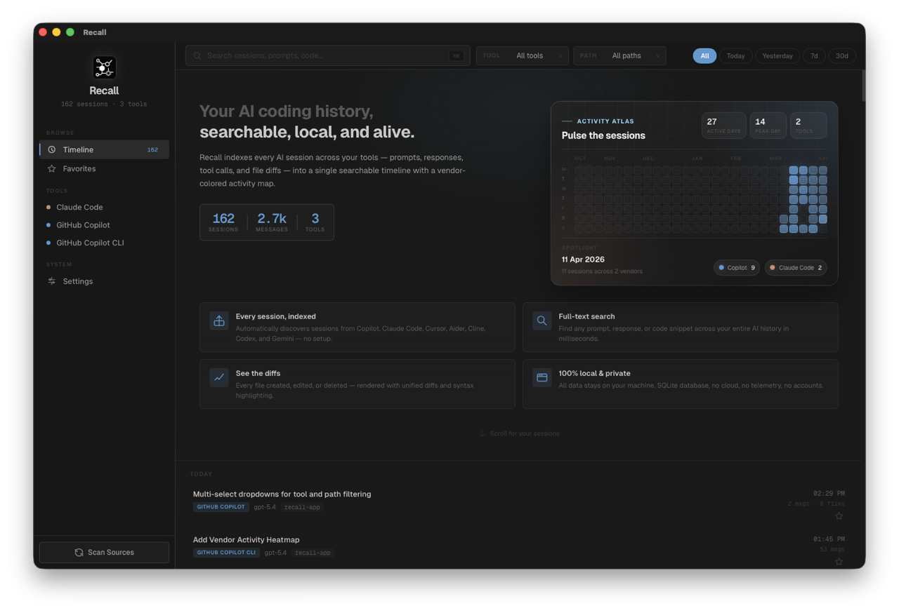
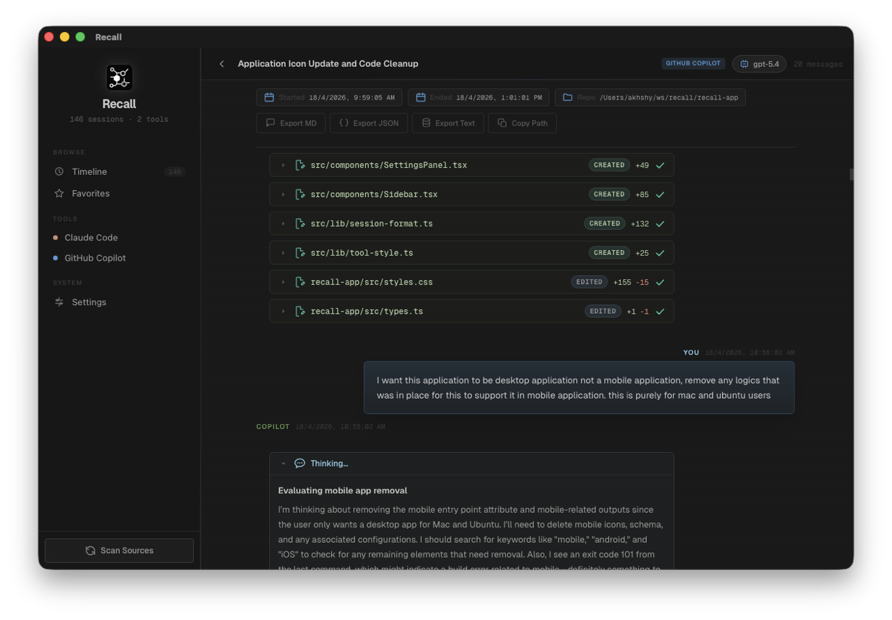

# Recall

Recall is a local-first Tauri desktop app for browsing AI coding session history that already exists on your machine. It scans supported tool stores, normalizes their conversations into a local SQLite database, and gives you a desktop UI for timeline browsing, search, favorites, session detail, and export.

The current codebase is centered around **React 19 + Vite** in `src/`, **Tauri 2** for the desktop shell, and a **Rust + SQLite FTS5** backend in `src-tauri/src/`.

## Screenshots

| Timeline overview | Session detail |
| --- | --- |
|  |  |

The screenshots above show the macOS build. The Linux desktop app uses the same layout and workflow.

## What the app does today

- Detects and indexes local session history from **Claude Code, GitHub Copilot, GitHub Copilot CLI, Cursor, Aider, Codex CLI, Cline, and Gemini CLI**
- Runs an initial background scan when the app starts, plus manual full scans from the sidebar
- Runs an incremental rescan every **30 seconds** while the app is open
- Stores normalized sessions and messages in a local SQLite database at:
  - macOS/Linux local data dir + `com.recall.app/recall.db`
- Supports:
  - timeline browsing grouped by date
  - full-text search over indexed message content
  - tool and date filters
  - favorites
  - per-session export to **Markdown**, **JSON**, or **plain text**
  - source detection/status in Settings
  - keyboard shortcuts: **Cmd/Ctrl+K** to focus search, **Escape** to leave search or session detail

## How the current architecture works

1. Each connector implements the `Connector` trait in `src-tauri/src/connectors/mod.rs` and exposes `detect()` and `scan()` logic for a specific tool.
2. `Indexer::collect_sessions()` calls every detected connector, streams normalized `Session` values through a channel, and keeps memory bounded while scanning.
3. The Tauri commands in `src-tauri/src/lib.rs` upsert those sessions into SQLite tables for `sessions`, `messages`, `file_changes`, `favorites`, and the FTS5 `search_index`.
4. The frontend in `src/App.tsx` loads timeline data, runs searches, refreshes the current view after scans, and polls for incremental changes.

Search is local-only. The current code does not send indexed session data to any remote service.

## Supported sources and paths in the current code

| Tool | Detection roots used now | Parsed source format |
| --- | --- | --- |
| Claude Code | `~/.claude`, `~/.config/claude` | files under `projects/` with `.jsonl`, `.json`, or `.claude` extensions |
| GitHub Copilot | VS Code `workspaceStorage` in stable and Insiders profiles | `chatSessions/*.jsonl` plus `chatEditingSessions/<session>/state.json` |
| GitHub Copilot CLI | `~/.copilot/session-state` | per-session directories with `workspace.yaml` and `events.jsonl` |
| Cursor | Cursor `globalStorage` and `workspaceStorage` on macOS/Linux | `state.vscdb` SQLite databases |
| Aider | `$HOME`, `$HOME/projects`, `$HOME/code`, `$HOME/dev`, `$HOME/src`, `$HOME/workspace` | `.aider.chat.history.md` files |
| Codex CLI | `$CODEX_HOME`, `~/.codex`, `~/.config/codex` | `sessions/rollout-*.jsonl` and `sessions/rollout-*.json` |
| Cline | VS Code global storage for `saoudrizwan.claude-dev` and `cline.cline` | task directories with `ui_messages.json` or `api_conversation_history.json` |
| Gemini CLI | `~/.gemini`, `~/.config/gemini` | JSON files inside `chats/` directories |

These paths come directly from the connector implementations in `src-tauri/src/connectors/`.

## UI behavior that exists today

### Timeline and browsing

- The sidebar shows timeline, favorites, settings, detected tool filters, and a scan button.
- Timeline sessions are grouped into labels such as **Today**, **Yesterday**, **This Week**, and **This Month**.
- Date filters are currently: **All**, **Today**, **Yesterday**, **7d**, and **30d**.

### Search

- Search is backed by SQLite FTS5 over message content.
- Results show a highlighted snippet, tool badge, time label, repository name when available, and message count.

### Session detail

- Session detail shows:
  - start/end timestamps
  - repo path and branch when available
  - all normalized messages in order
  - persisted session-level file change entries when the indexed source exposes structured edits
  - export buttons for Markdown / JSON / text
  - copy-to-clipboard for repo path and individual messages

### Message rendering

- All messages render as Markdown with GFM support.
- Code blocks use syntax highlighting with a VS Code Dark Modern-style theme.
- Diff blocks get a custom unified-diff renderer.
- GitHub Copilot sessions can render extra structured parts from message metadata, including:
  - thinking sections
  - tool invocation blocks
  - inline file edit previews and diffs reconstructed from Copilot edit state

## Important current limitations

- Source detection and connector paths are implemented for **macOS and Linux**. There is no Windows connector-path support in the current code.
- Full-text search indexes **message content** only; it does not currently index session metadata or file diffs.
- Persisted session-level file changes currently depend on connectors emitting structured `text_edit` parts. In the current codebase, that primarily means **GitHub Copilot** VS Code sessions.
- There is no dedicated lint script yet. The repository-level verification command is `npm run check`.

## Development

### Prerequisites

- Node.js and npm
- Rust toolchain
- Tauri prerequisites for your OS

### Install dependencies

```bash
npm install
```

### Run the desktop app

```bash
npm run tauri dev
```

### Build the frontend bundle

```bash
npm run build
```

### Verify frontend and backend

```bash
npm run check
```

### Cut a release

```bash
./scripts/release.sh 0.2.1
```

This updates `package.json`, `package-lock.json`, `src-tauri/Cargo.toml`, and `src-tauri/tauri.conf.json`, runs `npm run check`, commits the version bump, pushes the current branch, creates tag `v<version>`, and pushes the tag to trigger the release workflow.

## Project layout

| Path | Purpose |
| --- | --- |
| `src/App.tsx` | top-level app state, view switching, search, scan orchestration |
| `src/components/` | sidebar, session feed, detail views, settings, icons |
| `src/MessageBody.tsx` | Markdown, syntax highlighting, diff rendering, Copilot structured-part rendering |
| `src/api.ts` | frontend wrappers around Tauri commands |
| `src/lib/` | date grouping/filter helpers and tool styling |
| `docs/screenshots/` | README screenshots and public-facing repository media |
| `src-tauri/src/lib.rs` | Tauri commands, database initialization, app startup scan |
| `src-tauri/src/indexer.rs` | connector orchestration and session normalization |
| `src-tauri/src/db.rs` | SQLite schema, upsert/search/favorites/export logic |
| `src-tauri/src/connectors/` | per-tool detection and parsing logic |
| `src-tauri/src/models.rs` | normalized Rust models shared across indexing and commands |

## License

This project is licensed under the **MIT License**. See [`LICENSE`](./LICENSE).
